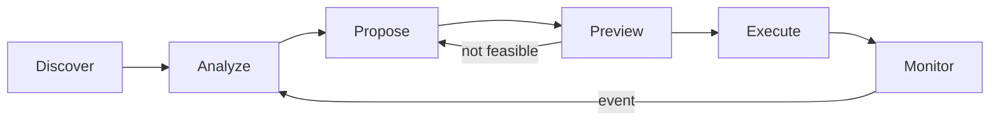

The agent loop is a structured 6-step cycle for AI-powered capital management on Gearbox. Each stage has clear inputs, outputs, and decision points.



| Step | Purpose | Who Decides |
| --- | --- | --- |
| **Discover** | Scan all current opportunities | SDK returns data |
| **Analyze** | Due diligence on shortlisted candidates | Agent reasons over data |
| **Propose** | Find optimal rebalance — or decide to do nothing | Agent + Router |
| **Preview** | Verify on-chain feasibility right now | SDK simulates |
| **Execute** | Sign and submit | User or agent via bot API |
| **Monitor** | React to events that require faster response | SDK returns live state |

## Step 1: Discover

Scan all available opportunities across chains. This is a broad survey — every pool, every strategy, every chain. The data is lightweight: headline APY, TVL, access requirements.

```typescript
const opportunities = await sdk.opportunities.search({
  chainIds: ["Mainnet", "Monad"],
  types: ["pool", "strategy"],
  assets: [Asset.STABLE],
});
```

The agent applies its own filters (APY floor, TVL minimum, permissionless-only, etc.) and produces a **shortlist** of candidates for deeper analysis.

## Step 2: Analyze

Due diligence on the shortlisted candidates. The agent inspects each one in detail using specialized research sub-agents:

| Sub-Agent | What It Evaluates |
| --- | --- |
| **Curator Research** | Governance quality, bad debt history, track record |
| **Token Research** | Collateral liquidity, oracle reliability, risk classification |
| **Profitability Forecast** | APY sustainability, yield type (organic vs incentivized), trend |
| **Risk Scoring** | 5 dimensions: collateral, curator, smart contract, market, exit |
| **Final Ranking** | `finalScore = adjustedApy * (1 - overallRisk)` |

```typescript
// Deep dive into a candidate
const detail = await sdk.pools.getDetail({ chainId, address: poolAddress });
const curator = await sdk.curators.getProfile(detail.curatorId);
const apyHistory = await sdk.history.getMetric({ target, metric: "apy", periodDays: 30 });
const events = await sdk.events.getFeed({ chainId, target, sinceDays: 30 });
```

The output is `AnalyzedOpportunity[]` — ranked by score, each with profitability forecasts, risk breakdowns, and reasoning.

## Step 3: Propose

From the analyzed candidates, find the **optimal action** — or decide that no rebalance is needed.

The agent considers:
- Is the current position already optimal?
- Would the rebalance cost (gas, slippage) exceed the expected gain?
- What's the best route for the chosen strategy?

If a rebalance makes sense:

```typescript
// Query router for optimal path
const route = await sdk.router.findOpenStrategyPath({
  chainId,
  creditManagerAddress,
  collateralToken,
  collateralAmount,
  debtAmount,
  targetToken,
  slippageBps: 50,
});

// Build the unsigned transaction
const tx = await sdk.accounts.openCreditAccount({
  chainId,
  creditManagerAddress,
  collateralToken,
  collateralAmount,
  debtAmount,
  pathCalls: route.calls,
  slippageBps: 50,
});
```

If no action is needed, the agent skips to Monitor.

## Step 4: Preview

Verify that the transaction is **feasible on-chain right now**. LLMs are not instant — by the time the agent finishes reasoning, on-chain conditions may have changed (liquidity exhausted, price moved, quota filled).

```typescript
const preview = await sdk.previewTransaction(tx);
```

The preview simulates the exact bytes against current chain state and returns:
- `success` — would this execute?
- `healthFactor` — projected HF after entry
- `actions[]` — human-readable step descriptions
- `balanceChanges[]` — net token movements
- `warnings[]` — concerns (stale oracle, high utilization, etc.)

### If preview fails → back to Propose

The agent does **not** re-analyze. The due diligence is still valid — the candidates are sound. Only the execution parameters need adjustment:

- Liquidity exhausted → reduce position size or try different route
- Price moved → adjust slippage tolerance
- Quota filled → switch to the next-ranked candidate from Analyze

```typescript
if (!preview.success || (preview.healthFactor ?? 0) < 1.4) {
  // Adjust parameters and re-propose
  // Do NOT re-run Analyze — the research is still valid
}
```

## Step 5: Execute

Sign and submit the transaction. The SDK **never signs** — execution is the caller's responsibility.

Two paths:

- **[Human-in-the-Loop](/developers/ga-human-loop)** — agent encodes preview as URL for verify.gearbox.finance, human reviews and signs
- **[Bot Execution](/developers/ga-bot-execution)** — agent signs via bot API with bounded on-chain permissions

```typescript
const txHash = await walletClient.sendTransaction({
  to: tx.to,
  data: tx.calldata,
  value: tx.value,
});
```

## Step 6: Monitor

Watch the live position and react to events. The monitor waits for signals — either scheduled (cron) or event-driven (alerts, external data).

```typescript
const position = await sdk.accounts.getStatus({ chainId, creditAccount });
const alerts = await sdk.monitor.getAlerts({ chainId, creditAccount });
```

### When events trigger a review → back to Analyze

The monitor doesn't jump to Propose — it goes back to **Analyze** to re-evaluate the situation with fresh data. This is critical: if a collateral token is dropping, the agent needs to understand the severity before deciding what to do.

| Event | Urgency | Response |
| --- | --- | --- |
| Scheduled check (cron, every 4h) | Normal | Full Analyze → Propose cycle |
| Collateral price dropping | Elevated | Quick Analyze → Propose adjustment |
| Critical event (hack, depeg, tweet) | Immediate | Emergency exit via Propose → Preview → Execute |
| Better opportunity detected | Normal | Analyze alternatives → Propose migration |
| HF approaching liquidation | Urgent | Analyze → Propose collateral top-up or debt reduction |

The urgency of the trigger determines the pace. A cron check runs the full cycle. A critical event skips straight to action — but still passes through Analyze to confirm the threat is real before executing.

## Learn More

- [MCP Server](/developers/ga-mcp) — MCP tools organized by loop stage
- [Execution](/developers/ga-execution) — How agents interact with the protocol safely
