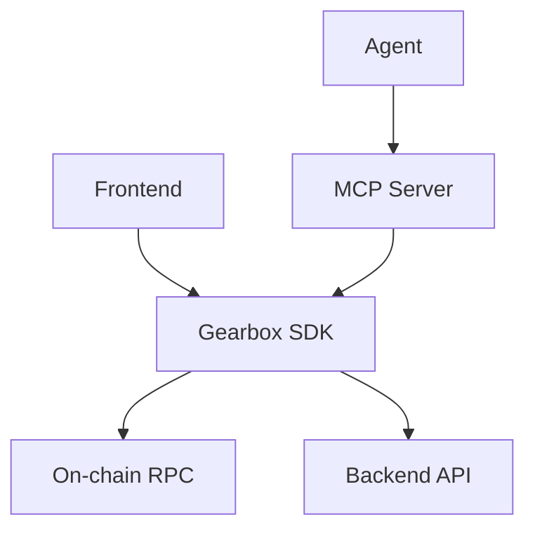

How agents and frontends share the same SDK, and why every tool has a visual representation.

## Architecture

- **Agents** access the SDK through the [MCP Server](/developers/ga-mcp) — 16 tools exposed as MCP tool calls
- **Frontends** use the SDK directly — same methods, same types
- Both paths reach the same canonical API — identical data, identical types

The SDK talks to two backends:
- **On-chain RPC** — protocol reads, transaction simulation, live state
- **Backend API** — history, cached metrics, curator/token metadata (optional — SDK degrades gracefully without it)

## One Type, One Tool, One Component

Every SDK method returns a typed result. That same type is:
- Exposed as an **MCP tool** for agents (JSON)
- Rendered by a **UI component** for humans (React)

This means an agent chat interface can show the same cards, tables, and previews that a regular user sees — not just raw text.

## Tool Visualization Map

| SDK Method | MCP Tool | UI Component | Data |
| --- | --- | --- | --- |
| `sdk.opportunities.search()` | `list_opportunities` | `<OpportunityList />` | Pools & strategies with APY, TVL, access |
| `sdk.pools.list()` | `list_pools` | `<PoolList />` | LP opportunities |
| `sdk.strategies.list()` | `list_strategies` | `<StrategyList />` | Leveraged strategies |
| `sdk.pools.getDetail()` | `get_pool_detail` | `<PoolDetail />` | Full pool snapshot: tokens, rates, capacity |
| `sdk.strategies.getDetail()` | `get_strategy_detail` | `<StrategyDetail />` | Strategy params, leverage, collaterals |
| `sdk.curators.getProfile()` | `get_curator` | `<CuratorProfile />` | Track record, bad debt history, TVL |
| `sdk.tokens.getMarketData()` | `get_token_liquidity` | `<TokenCard />` | Oracle price, liquidity depth |
| `sdk.history.getMetric()` | `get_metric_history` | `<MetricChart />` | APY, utilization, TVL time series |
| `sdk.events.getFeed()` | `get_events` | `<EventFeed />` | Parameter changes, pending governance |
| `sdk.positions.prepareOpen()` | `prepare_position` | `<PositionBuilder />` | Unsigned transaction (RawTx) |
| `sdk.previewTransaction()` | `simulate_position` | `<TransactionPreview />` | Simulated outcome: HF, actions, warnings |
| `sdk.accounts.getStatus()` | `get_position_status` | `<PositionStatus />` | Live health factor, balances, alerts |

## What This Enables

- **Frontend developers** build UIs using SDK + `@gearbox-protocol/uikit` components
- **Agent developers** get identical data quality through MCP tools
- **Agent UIs** (chat with visualization) render MCP tool results using the same UI components — same experience as the native frontend

## Learn More

- [MCP Server](/developers/ga-mcp) — all 16 tools in detail
- [The Agent Loop](/developers/ga-agent-loop) — how tools are used at each stage
- [SDK Namespaces](/developers/gm-start-namespaces) — full SDK namespace reference
