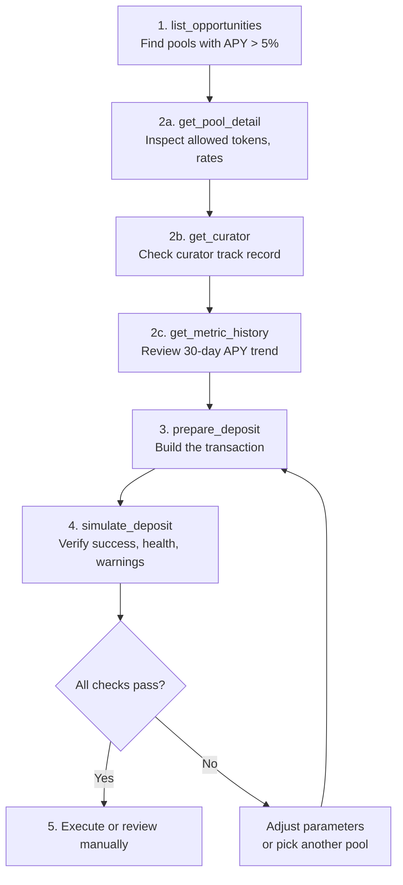

This walkthrough takes you through a complete **discover, analyze, preview** flow using MCP tools. By the end, you will have found a yield opportunity, researched its risk profile, and simulated a deposit — all through natural conversation with an LLM agent.

Before starting, make sure you have [set up the MCP server](/developers/ga-setup-mcp).

## Step 1: Discover Opportunities

Start by asking your agent to find yield opportunities. The `list_opportunities` tool searches across chains and returns pools and strategies with headline APY, TVL, and access requirements.

> Find all permissionless pool opportunities on Mainnet with APY above 5%

The agent calls:

```
Tool: list_opportunities
Input: {
  "types": ["pool"],
  "chain_ids": [1],
  "include_paused": false
}
```

You get back a list of opportunities, each with:

- **title** — human-readable name (e.g. "USDC Lending Pool")
- **headlineApy** — current total APY
- **tvlUsd** — total value locked
- **depositToken** — what you deposit (USDC, WETH, etc.)
- **access** — whether it is permissionless or requires KYC
- **risk.warnings** — any red flags

Pick a candidate that matches your criteria. Note its `chainId` and `poolAddress` for the next step.

## Step 2: Analyze the Candidate

Now dig deeper into the pool you selected. This stage uses multiple tools to build a full picture of risk and return.

### 2a. Get Pool Details

> Show me the full details for pool 0xABC... on Mainnet

```
Tool: get_pool_detail
Input: {
  "chain_id": 1,
  "address": "0xABC..."
}
```

This returns the pool's allowed tokens, current utilization, borrow rates, capacity limits, and the curator who manages its risk parameters. Pay attention to:

- **allowedTokens** — which collateral the pool accepts and their liquidation thresholds
- **availableLiquidity** — how much room remains for deposits
- **isPaused** — whether the pool is currently active

### 2b. Research the Curator

Every pool is managed by a curator who sets risk parameters. Check their track record:

> Who is the curator for this pool? What is their track record?

```
Tool: get_curator
Input: {
  "curator_id": "steakhouse"
}
```

The curator profile reveals:

- **badDebtEvents** and **badDebtUsd** — historical losses (lower is better)
- **parameterChanges30d** — how actively they manage the pool (too few changes may signal neglect, too many may signal instability)
- **totalTvlUsd** — total value they manage across all pools
- **isActive** — whether they are still actively managing

### 2c. Check Historical Performance

> Show me the APY history for this pool over the last 30 days

```
Tool: get_metric_history
Input: {
  "chain_id": 1,
  "target": "0xABC...",
  "metric": "apy",
  "period_days": 30
}
```

Compare the current APY against the 30-day trend. A pool showing 12% APY today but averaging 4% over the month may be experiencing a temporary spike. Look for:

- **Stability** — low standard deviation means more predictable returns
- **Trend** — is APY trending up or down?
- **Yield type** — organic yield is more sustainable than incentivized yield

## Step 3: Prepare a Deposit

Once you are satisfied with the analysis, prepare the deposit transaction. This builds the transaction without sending it.

> Prepare a deposit of 10,000 USDC into pool 0xABC... on Mainnet

```
Tool: prepare_deposit
Input: {
  "chain_id": 1,
  "pool_address": "0xABC...",
  "amount": "10000000000",
  "token": "USDC"
}
```

The tool returns a `RawTx` object containing the transaction `to` address and `calldata`. This is the exact transaction that would be sent to the blockchain, but it has not been signed or submitted yet.

## Step 4: Preview the Transaction

Before committing any funds, simulate the transaction to see exactly what will happen on-chain.

> Simulate this deposit and show me the expected outcome

```
Tool: simulate_deposit
Input: {
  "raw_tx": {
    "to": "0x...",
    "calldata": "0x..."
  }
}
```

The simulation returns a full breakdown:

```
{
  "success": true,
  "healthFactor": 2.1,
  "warnings": [],
  "actions": [
    { "title": "Deposit 10,000 USDC", "description": "Added to lending pool" }
  ],
  "balanceChanges": [
    { "token": "USDC", "delta": "-10000", "direction": "out" },
    { "token": "dUSDC", "delta": "9987.5", "direction": "in" }
  ],
  "gasEstimate": "142000"
}
```

### What to Check

Before approving the transaction, verify these conditions:

1. **`success` is `true`** — the transaction would not revert
2. **`healthFactor` > 1.4** — sufficient safety margin (for leveraged positions)
3. **No critical warnings** — review any items in the `warnings` array
4. **Balance changes look correct** — you are sending the expected token and receiving the right pool token
5. **Actions match your intent** — the human-readable action list should describe exactly what you asked for
6. **Gas estimate is reasonable** — no unexpectedly high gas costs

## Step 5: Review Before Execution

At this point, you have a fully simulated transaction with confirmed outcomes. Before executing:

### Option A: Execute Through the Agent

If your agent has signing capabilities and you trust the setup:

> Execute this transaction

The agent calls `execute_transaction` with the raw transaction data. The SDK submits it to the blockchain and returns a transaction hash.

### Option B: Manual Review and Approval

For higher security, review the transaction independently before signing. The transaction calldata can be inspected at:

**[verify.gearbox.finance](https://verify.gearbox.finance)** — paste the raw transaction to decode the multicall, view each step, and simulate on a fork before signing in your wallet.

This is the recommended approach for large deposits or when the agent is not trusted with automatic execution.

### Understanding the Preview Output

| Field            | What it tells you                                       |
| ---------------- | ------------------------------------------------------- |
| `success`        | Whether the transaction would execute without reverting |
| `healthFactor`   | Projected solvency ratio (only for leveraged positions) |
| `warnings`       | Risk flags — review each one before proceeding          |
| `actions`        | Step-by-step breakdown of what the multicall does       |
| `balanceChanges` | Net token movements for your wallet                     |
| `routes`         | Swap paths used, including price impact per hop         |
| `exitInfo`       | Whether closing will involve delayed withdrawal         |
| `gasEstimate`    | Estimated gas cost in wei                               |

## Full Flow Summary



## Next Steps

- [MCP Setup](/developers/ga-setup-mcp) — configure additional chains or environment variables
- [Getting Started](/developers/ga-start) — overview of both MCP and SDK integration paths
