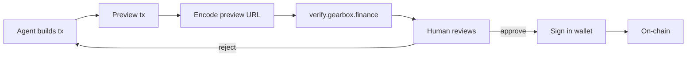

The Human-in-the-Loop execution mode means the agent builds and previews transactions, but a human reviews and approves every action before it goes on-chain.

## The Flow



1. **Agent builds** — `sdk.positions.prepareOpen(params)` → `RawTx`
2. **Agent previews** — `sdk.previewTransaction(rawTx)` → `TransactionPreview`
3. **Agent encodes** — preview data encoded as URL: `verify.gearbox.finance/?tx=<encoded>`
4. **Human reviews** at verify.gearbox.finance:
   - Decoded calldata (human-readable actions)
   - Token balance changes (what goes in, what comes out)
   - Swap routes and price impact
   - Projected Health Factor
   - Warnings and concerns
5. **Human approves** → signs in wallet (MetaMask, Safe, etc.)
6. **Transaction executes** — exact bytes from preview

## Why This Works

- **Same bytes** — what was previewed is what gets signed. No deviation.
- **No key management** — the agent never holds private keys
- **Auditable** — the preview URL creates a shareable record of what was proposed
- **LLM-friendly** — the preview actions are human-readable, so both the agent and the human can understand them

## When to Use

| Scenario | Recommendation |
| --- | --- |
| First deployment / building trust | Always human-in-the-loop |
| High-value positions (>\$100K) | Human-in-the-loop |
| Institutional / compliance requirements | Human-in-the-loop |
| Routine rebalancing | Consider [Bot Execution](/developers/ga-bot-execution) |

## Example

```typescript
// Agent builds the transaction
const rawTx = await sdk.positions.prepareOpen({
  chainId: "Mainnet",
  strategy: strategyId,
  depositToken: "USDC",
  depositAmount: 10_000n * 10n ** 6n,
  leverage: 3,
});

// Agent previews
const preview = await sdk.previewTransaction(rawTx);

if (preview.success && preview.healthFactor > 1.4) {
  // Encode for human review
  const verifyUrl = `https://verify.gearbox.finance/?tx=${encodePreview(preview)}`;
  console.log(`Review and approve: ${verifyUrl}`);
  // Human opens URL, reviews, signs in wallet
}
```

## Learn More

- [Bot Execution](/developers/ga-bot-execution) — autonomous execution with bounded permissions
- [The Agent Loop](/developers/ga-agent-loop) — where Preview and Execute fit in the cycle
