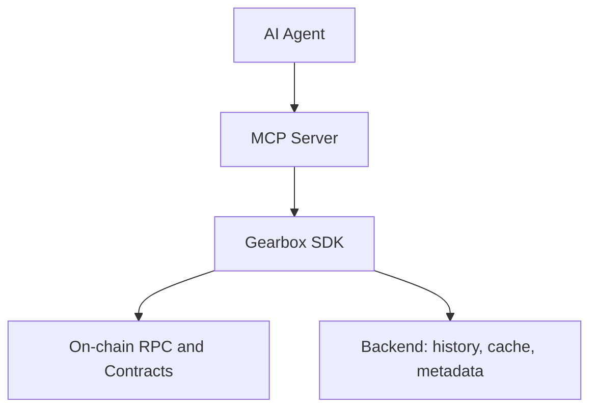

The Gearbox MCP (Model Context Protocol) Server exposes SDK methods as tool calls for LLM agents. It is a thin adapter -- no duplicated business logic. MCP tool responses are direct SDK models or thin wrappers around them.

## MCP in the Stack



The MCP Server is **not** the source of truth. The source of truth is:

1. Smart contracts for live protocol state
2. SDK public domain model for integration
3. Backend for enrichment, history, and metadata

MCP is the agent transport layer -- a tool-oriented presentation of SDK methods.

## Tools by Stage

The 16 MCP tools map directly to the [agent loop](/developers/ga-agent-loop) stages:

### Discovery

| MCP Tool | SDK Method | Description |
|----------|-----------|-------------|
| `list_opportunities` | `sdk.opportunities.search()` | Unified discovery across pools and strategies |
| `list_pools` | `sdk.pools.list()` | Pool-specific discovery with APY, TVL, active assets |
| `list_strategies` | `sdk.strategies.list()` | Strategy-specific discovery with leverage, debt bounds |

**Example -- list_opportunities:**

```typescript
// MCP input
list_opportunities({
  chain_ids: ["Mainnet", "Monad"],
  types: ["pool", "strategy"],
  assets: ["stable"],
  include_paused: false,
})

// Maps to SDK
const results = await sdk.opportunities.search({
  chainIds: ["Mainnet", "Monad"],
  types: ["pool", "strategy"],
  assets: [Asset.STABLE],
  includePaused: false,
});
```

### Analysis

| MCP Tool | SDK Method | Description |
|----------|-----------|-------------|
| `get_pool_detail` | `sdk.pools.getDetail()` | Full pool parameters, allowed tokens, constraints |
| `get_strategy_detail` | `sdk.strategies.getDetail()` | Strategy parameters, CM addresses, exit mechanics |
| `get_metric_history` | `sdk.history.getMetric()` | Historical APY, TVL, utilization, borrow rates |
| `get_events` | `sdk.events.getFeed()` | Parameter changes, governance events, pending changes |
| `get_curator` | `sdk.curators.getProfile()` | Curator track record, bad debt history, managed pools |
| `get_token_info` | `sdk.tokens.getProfiles()` | Token profiles and metadata |
| `get_token_liquidity` | `sdk.tokens.getMarketData()` | Liquidity depth, market data for sizing checks |

**Example -- get_pool_detail:**

```typescript
// MCP input
get_pool_detail({
  chain_id: "Mainnet",
  pool_address: "0x...",
})

// Maps to SDK
const detail = await sdk.pools.getDetail({
  chainId: "Mainnet",
  poolAddress: "0x...",
});
```

### Action Preparation

| MCP Tool | SDK Method | Description |
|----------|-----------|-------------|
| `prepare_deposit` | `sdk.positions.prepareDeposit()` | Build a pool deposit transaction |
| `prepare_position` | `sdk.positions.prepareOpen()` | Build a strategy open transaction with route |
| `simulate_deposit` | `sdk.positions.previewDeposit()` | Preview a pool deposit outcome |
| `simulate_position` | `sdk.positions.previewOpen()` | Preview a strategy position outcome |

**Example -- prepare_position:**

```typescript
// MCP input
prepare_position({
  chain_id: "Mainnet",
  credit_manager: "0x...",
  collateral_token: "0xA0b8...USDC",
  collateral_amount: "100000000000",
  debt_amount: "200000000000",
  target_token: "0xae78...stETH",
  slippage_bps: 50,
})

// Maps to SDK
const route = await sdk.router.findOpenStrategyPath({ ... });
const tx = await sdk.accounts.openCreditAccount({ ... });
const preview = await sdk.previewTransaction(tx);
```

### Execution

| MCP Tool | SDK Method | Description |
|----------|-----------|-------------|
| `execute_transaction` | `sdk.transactions.execute()` | Submit a prepared and previewed transaction |

The SDK does not hold private keys. The `execute_transaction` tool routes the `RawTx` through the configured signer.

### Monitoring

| MCP Tool | SDK Method | Description |
|----------|-----------|-------------|
| `get_pool_status` | `sdk.pools.getStatus()` | Current pool state: rates, utilization, liquidity |
| `get_position_status` | `sdk.accounts.getStatus()` | Position health factor, value, debt, alerts |

**Example -- get_position_status:**

```typescript
// MCP input
get_position_status({
  chain_id: "Mainnet",
  credit_account: "0x...",
})

// Maps to SDK
const status = await sdk.accounts.getStatus({
  chainId: "Mainnet",
  creditAccount: "0x...",
});
```

## Complete Mapping Reference

| MCP Tool | SDK Method | Stage |
|----------|-----------|-------|
| `list_opportunities` | `sdk.opportunities.search()` | Discover |
| `list_pools` | `sdk.pools.list()` | Discover |
| `list_strategies` | `sdk.strategies.list()` | Discover |
| `get_pool_detail` | `sdk.pools.getDetail()` | Analyze |
| `get_strategy_detail` | `sdk.strategies.getDetail()` | Analyze |
| `get_metric_history` | `sdk.history.getMetric()` | Analyze |
| `get_events` | `sdk.events.getFeed()` | Analyze |
| `get_curator` | `sdk.curators.getProfile()` | Analyze |
| `get_token_info` | `sdk.tokens.getProfiles()` | Analyze |
| `get_token_liquidity` | `sdk.tokens.getMarketData()` | Analyze |
| `prepare_deposit` | `sdk.positions.prepareDeposit()` | Propose |
| `prepare_position` | `sdk.positions.prepareOpen()` | Propose |
| `simulate_deposit` | `sdk.positions.previewDeposit()` | Preview |
| `simulate_position` | `sdk.positions.previewOpen()` | Preview |
| `execute_transaction` | `sdk.transactions.execute()` | Execute |
| `get_pool_status` | `sdk.pools.getStatus()` | Monitor |
| `get_position_status` | `sdk.accounts.getStatus()` | Monitor |

## Runtime Modes

The MCP Server inherits SDK runtime modes:

**Core-Only Mode** -- chain access works, backend unavailable. Discovery, prepare, simulate, execute, and monitoring all work. History, curator profiles, and cached APY are degraded.

**Enriched Mode** -- chain + backend available. Full history, metadata, human-readable events, and cached classification surfaces.

All tool responses carry `freshness` metadata so the agent knows the data quality:

```typescript
{
  asOf: "2025-04-07T10:30:00Z",
  sources: ["onchain", "backend-cache"],
  backendAvailable: true
}
```

## Learn More

- [The Agent Loop](/developers/ga-agent-loop) -- how tools map to the 6-step loop
- [Transaction Preview](/developers/ga-preview) -- the security gate between Propose and Execute
- [Execution Modes](/developers/ga-execution) -- what happens after the agent calls `execute_transaction`
