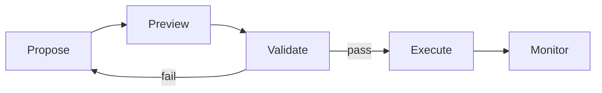

Transaction Preview is the universal security gate in Gearbox Agentic. A single SDK method -- `sdk.previewTransaction(tx)` -- simulates any Gearbox transaction and returns a full breakdown of what will happen before any funds are committed.

## Key Principle

**Same bytes previewed = same bytes executed.** The input to `previewTransaction` is the actual `RawTx` -- the exact calldata that would be sent to the network. This is not a parameter-based estimate; it is a simulation of the real transaction.

## Transaction Lifecycle



## Input

The method accepts a `RawTx` -- the unsigned transaction built in the Propose stage:

```typescript
interface RawTx {
  to: Address;
  calldata: Hex;
  value?: bigint;
}
```

One method handles all Gearbox transactions: open credit account, close, adjust, add collateral, swap -- everything. The agent does not need to know which preview method to call.

## Output

```typescript
const preview = await sdk.previewTransaction(tx);
```

The preview returns:

```typescript
interface TransactionPreview {
  // Would this transaction execute?
  success: boolean;
  // Any concerns
  warnings: string[];
  // Projected health factor after entry
  healthFactor?: number;
  // Estimated gas cost
  gasEstimate?: string;

  // Human-readable breakdown of multicall actions
  actions: Array<{
    title: string;        // e.g. "Deposit 100,000 USDC"
    description: string;  // e.g. "Collateral added to credit account"
    protocol?: string;    // e.g. "Curve", "1inch"
  }>;

  // Net token movements for the wallet
  balanceChanges: Array<{
    token: TokenRef;
    delta: string;
    direction: "in" | "out";
  }>;

  // Swap route details
  routes?: Array<{
    tokenIn: TokenRef;
    tokenOut: TokenRef;
    amountIn: string;
    expectedOut: string;
    priceImpactBps?: number;
    dex?: string;
  }>;

  // Exit characteristics for this position
  exitInfo?: {
    hasDelayedWithdrawal: boolean;
    zeroSlippageAvailable: boolean;
  };
}
```

## What the Agent Validates

Before proceeding to execution, the agent checks every aspect of the preview:

```typescript
// 1. Did simulation succeed?
if (!preview.success) {
  throw new Error("Transaction would revert");
}

// 2. Is health factor safe?
if ((preview.healthFactor ?? 0) < 1.4) {
  // Go back to PROPOSE, reduce leverage
}

// 3. Any warnings?
if (preview.warnings.length > 0) {
  // Evaluate each warning, decide to proceed or abort
}

// 4. Review balance changes
for (const change of preview.balanceChanges) {
  // Verify no unexpected tokens leave the wallet
  // Verify amounts match expectations
}

// 5. Review actions
for (const action of preview.actions) {
  // "Deposit 100,000 USDC" -- correct
  // "Borrow 200,000 USDC" -- correct
  // "Swap 200,000 USDC to stETH via 1inch" -- correct
}

// 6. Check swap routes
for (const route of preview.routes ?? []) {
  if ((route.priceImpactBps ?? 0) > 100) {
    // > 1% price impact -- consider reducing size
  }
}

// 7. Understand exit conditions
if (preview.exitInfo?.hasDelayedWithdrawal) {
  // Closing will involve phantom tokens -- factor into decision
}
```

## Verify URL

The preview can be encoded as a URL for human review at [verify.gearbox.finance](https://verify.gearbox.finance). The verifier displays:

- **Decoded calldata** -- the inner `MultiCall[]` structure decoded against Gearbox ABIs
- **Actions** -- human-readable list of what the transaction does
- **Balance changes** -- net token movements
- **Health factor projection** -- projected HF after execution
- **Warnings** -- any concerns flagged by the simulation

This is the bridge between autonomous agents and human approval. The agent builds and previews; the human verifies and signs.

## Looping Back

If the preview fails or shows unacceptable results, the agent adjusts and retries:

```
PREVIEW -> constraints fail -> PROPOSE (adjust parameters) -> PREVIEW
```

The agent can adjust leverage, debt amount, slippage tolerance, or select a different strategy entirely, then rebuild the transaction and preview again.

## Why One Method

Traditional DeFi integrations require different preview methods for different transaction types. Gearbox uses a single `previewTransaction` that works for any `RawTx`. This means:

- Agents do not need to know the transaction type to preview it
- The same security gate applies to every operation
- Independent verifiers can simulate any Gearbox transaction using the same method
- The preview surface cannot be bypassed by using a different code path

## Learn More

- [The Agent Loop](/developers/ga-agent-loop) -- how Preview fits into the 6-step loop
- [Execution Modes](/developers/ga-execution) -- what happens after preview validation
- [MCP Server](/developers/ga-mcp) -- `simulate_deposit` and `simulate_position` tools
