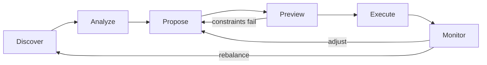

Gearbox Agentic lets AI agents and programmatic integrators discover yield opportunities, analyze risk, and prepare transactions across the Gearbox protocol. There are two ways to get started, depending on how you want to interact.

## Option 1: MCP Setup (Recommended for LLM Agents)

If you are using an LLM agent like Claude, ChatGPT, or any MCP-compatible client, the fastest path is to install the **Gearbox MCP server**. This gives your agent direct access to 16+ tools for discovering pools, analyzing curators, simulating deposits, and more — all through natural language conversation.

Best for: Claude Desktop, Cursor, Windsurf, custom MCP clients.

[Set up MCP Server](/developers/ga-setup-mcp)

## Option 2: Build a Custom Agent with the SDK

If you are building a standalone agent, bot, or backend service, you can integrate the **Gearbox SDK** directly into your TypeScript application. The SDK is the canonical public API that the MCP server itself wraps. This gives you full control over the agent loop: discover, analyze, propose, preview, execute, and monitor.

Best for: automated vaults, rebalancing bots, custom dashboards, programmatic integrators.

[Build your first agent](/developers/ga-first-agent)

## The Agent Loop

Both paths follow the same six-stage lifecycle:

| Stage    | What happens                                          |
| -------- | ----------------------------------------------------- |
| Discover | Find yield opportunities across chains                |
| Analyze  | Inspect details, history, risk, curator quality       |
| Propose  | Build intended transaction                            |
| Preview  | Simulate exact on-chain outcome before committing     |
| Execute  | Sign and submit the transaction                       |
| Monitor  | Watch the live position and react to changes          |

## Next Steps

- [MCP Setup](/developers/ga-setup-mcp) — install and configure the MCP server
- [First Agent](/developers/ga-first-agent) — walk through a complete discover-to-preview flow
